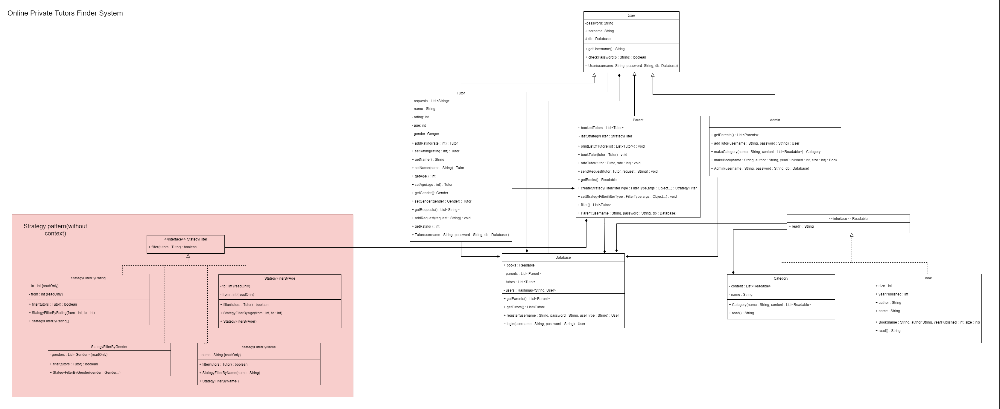

# Online Private Tutors Finder System

### The task:
This private tutor system will help to find tuition teachers
from nearby locations. Teachers can also get a student
just by logging onto the website and setting up the profile.
In the personal tutor finder system, there are three
entities namely, Admin, Parents, and Tutor. Admin can
login, manage tutor by adding new teachers and update
their profiles. Admin can also manage E-books by adding
new books to the library. Admin can also check for the
registered parents. Admin will register tutors and
credentials will be shared with tutors by Email. Parents
can register and login, tutors can be viewed by parents.
Parents can filter and select the tutor and after selecting
parents will raise the request of the demo lecture. After
attending the lecture, they can book the tutor online, rate
the tutor and view the E-Books. The tutor can login by
using credentials that will be provided by mail. They can
check for the request for a demo lecture and accept the
request. They can also check the booking done. They
need to set their profile. This private tuition system can
help the tutors to get students and parents to find the best
tutors for their children.
